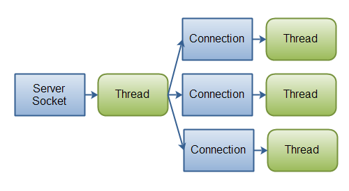

<p style="color:red"><b>CATELOG</b></p>

I. [UnitTest](#UnitTest)
II. [Threading](#threading)
III. [Net working](#Networking)

### I. Unit Test/Logging/Perfomance <a id="UnitTest"></a>

1. Unit test
- Unit Test là một phần chương trình được viết bởi developer, thực hiện một chức năng nhất định, và sẽ được test
- Unit test giúp kiểm tra logic vủa một chương trình là đúng hay sai.
- Một Unit test có thể là một đoạn code, một mothod, một class... 
- Mục đích viết Unit test là để phân chia chườn trình thành các phần nhỏ, và kiểm tra tính đúng đắn của từng phần 
<b></b>

### II.  Threading <a id="threading"></a>

#### 1. Thread
- <b style="color:red">A process</b> is a self contained execution environment and it can be seen as a program or application.
- <b style="color:red">Thread</b> can be called lightweight process. Thread requires less resources to create and exists in the process, thread shares the process resources.

- A thread goes through various stages in its life cycle. For example, a thread is born, started, runs, and then dies. The following diagram shows the complete life cycle of a thread.


<b>New </b> A new thread begins its life cycle in the new state. It remains in this state until the program starts the thread. It is also referred to as a born thread.

<b>Runnable</b> After a newly born thread is started, the thread becomes runnable. A thread in this state is considered to be executing its task.

<b> Waiting </b>− Sometimes, a thread transitions to the waiting state while the thread waits for another thread to perform a task. A thread transitions back to the runnable state only when another thread signals the waiting thread to continue executing.

<b>Dead</b> A thread enters the terminated state when it completes its task or terminates.

<b>Multithreading</b> refers to tow or more threads excuting concurrently in a program. A computer single core hve only one thread excutes at a time.

<b style="color:red">Java thread benefits</b>:  
    - threads are lightweigh compared to processes, it take less time and resources to create a thread.
    - thread shares their parents process and code.

#### How to create thread in Java
Threads can be created by using two mechanisms :
+ Extending the Thread class
+ Implementing the Runnable Interface

<b>Thread creation by extending the Thread class</b>
We create a class that extends the java.lang.Thread class. This class overrides the run() method available in the Thread class. A thread begins its life inside run() method. We create an object of our new class and call start() method to start the execution of a thread. Start() invokes the run() method on the Thread object.

```
// Java code for thread creation by extending 
// the Thread class 
class MultithreadingDemo extends Thread 
{ 
    public void run() 
    { 
        try
        { 
            // Displaying the thread that is running 
            System.out.println ("Thread " + 
                  Thread.currentThread().getId() + 
                  " is running"); 
  
        } 
        catch (Exception e) 
        { 
            // Throwing an exception 
            System.out.println ("Exception is caught"); 
        } 
    } 
} 
  
// Main Class 
public class Multithread 
{ 
    public static void main(String[] args) 
    { 
        int n = 8; // Number of threads 
        for (int i=0; i<8; i++) 
        { 
            MultithreadingDemo object = new MultithreadingDemo(); 
            object.start(); 
        } 
    } 
} 
```
Ouput

```
Thread 8 is running
Thread 9 is running
Thread 10 is running
Thread 11 is running
Thread 12 is running
Thread 13 is running
Thread 14 is running
Thread 15 is running
```

However, in Java 8 we can create Thread like below
```
Thread t = new Thread(() -> {System.out.println("My Runnable");});
t.start();
```

<b>Thread creation by implementing the Runnable Interface</b>

```
class MultithreadingDemo implements Runnable 
{ 
    public void run() 
    { 
        try
        { 
            // Displaying the thread that is running 
            System.out.println ("Thread " +     
                                Thread.currentThread().getId() + 
                                " is running"); 
  
        } 
        catch (Exception e) 
        { 
            // Throwing an exception 
            System.out.println ("Exception is caught"); 
        } 
    } 
} 
  
// Main Class 
class Multithread 
{ 
    public static void main(String[] args) 
    { 
        int n = 8; // Number of threads 
        for (int i=0; i<8; i++) 
        { 
            Thread object = new Thread(new MultithreadingDemo()); 
            object.start(); 
        } 
    } 
} 
```

Output :
```
Thread 8 is running
Thread 9 is running
Thread 10 is running
Thread 11 is running
Thread 12 is running
Thread 13 is running
Thread 14 is running
Thread 15 is running

```
<b>Thread Class vs Runnable Interface </b>
 - If we extend the Thread class, our class cannot extend any other class because Java doesn’t support multiple inheritance. But, if we implement the Runnable interface, our class can still extend other base classes.

<b style="color:red" >Java Sleep</b>
Thread.sleep() method can be used to pause the execution of current thread for specified time in milliseconds. The argument value for milliseconds can’t be negative, else it throws IllegalArgumentException.

```
public class ThreadSleep {

    public static void main(String[] args) throws InterruptedException {
        long start = System.currentTimeMillis();
        Thread.sleep(2000);
        System.out.println("Sleep time in ms = "+(System.currentTimeMillis()-start));
        
    }

}
```
<i><b>How Thread Sleep Works</b></i>
Thread.sleep() interacts with the thread scheduler to put the current thread in wait state for specified period of time. Once the wait time is over, thread state is changed to runnable state and wait for the CPU for further execution. So the actual time that current thread sleep depends on the thread scheduler that is part of operating system.

<b style="color:red">Java Thread join </b>
<b>public final void join()</b>: This java thread join method puts the current thread on wait until the thread on which it’s called is dead. If the thread is interrupted, it throws InterruptedException.
<b>public final synchronized void join(long millis)</b>: This java thread join method is used to wait for the thread on which it’s called to be dead or wait for specified milliseconds. Since thread execution depends on OS implementation, it doesn’t guarantee that the current thread will wait only for given time.

see example below
```
public class ThreadJoinExample {

    public static void main(String[] args) {
        Thread t1 = new Thread(new MyRunnable(), "t1");
        Thread t2 = new Thread(new MyRunnable(), "t2");
        Thread t3 = new Thread(new MyRunnable(), "t3");
        
        t1.start();
        
        //start second thread after waiting for 2 seconds or if it's dead
        try {
            t1.join(2000);
        } catch (InterruptedException e) {
            e.printStackTrace();
        }
        
        t2.start();
        
        //start third thread only when first thread is dead
        try {
            t1.join();
        } catch (InterruptedException e) {
            e.printStackTrace();
        }
        
        t3.start();
        
        //let all threads finish execution before finishing main thread
        try {
            t1.join();
            t2.join();
            t3.join();
        } catch (InterruptedException e) {
            // TODO Auto-generated catch block
            e.printStackTrace();
        }
        
        System.out.println("All threads are dead, exiting main thread");
    }

}

class MyRunnable implements Runnable{

    @Override
    public void run() {
        System.out.println("Thread started:::"+Thread.currentThread().getName());
        try {
            Thread.sleep(4000);
        } catch (InterruptedException e) {
            e.printStackTrace();
        }
        System.out.println("Thread ended:::"+Thread.currentThread().getName());
    }
    
}
```
Output
```
Thread started:::t1
Thread started:::t2
Thread ended:::t1
Thread started:::t3
Thread ended:::t2
Thread ended:::t3
All threads are dead, exiting main thread
```


<b style="color:red">Thread Life Cycle in Java</b>

From previous, we can create a java thread class by implementing Runnable interface or by extending Thread class, but to start a java thread, we first have to create the Thread object and call it’s start() method to execute run() method as a thread.


<b>New</b>
When we create a new Thread object using new operator, thread state is New Thread. At this point, thread is not alive and it’s a state internal to Java programming.

<b>Runnable</b>
When we call start() function on Thread object, it’s state is changed to Runnable. Whether to run this thread instantly or keep it in runnable thread pool before running, depends on the OS implementation of thread scheduler.

<b>Running</b>
When thread is executing, it’s state is changed to Running. Thread scheduler picks one of the thread from the runnable thread pool and change it’s state to Running. Then CPU starts executing this thread. A thread can change state to Runnable, Dead or Blocked from running state depends on time slicing, thread completion of run() method or waiting for some resources.

<b>Blocked/Waiting</b> 
A thread can be waiting for other thread to finish using thread join or it can be waiting for some resources to available. For example producer consumer problem or waiter notifier implementation or IO resources, then it’s state is changed to Waiting. Once the thread wait state is over, it’s state is changed to Runnable and it’s moved back to runnable thread pool.

<b>Dead</b>
Once the thread finished executing, it’s state is changed to Dead and it’s considered to be not alive.

<b style="color:red">Java Thread wait, notify and notifyAll Example
</b>

<b>wait</b>
Object wait methods has three variance, one which waits indefinitely for any other thread to call notify or notifyAll method on the object to wake up the current thread. Other two variances puts the current thread in wait for specific amount of time before they wake up.
<b >notify</b>
notify method wakes up only one thread waiting on the object and that thread starts execution. So if there are multiple threads waiting for an object, this method will wake up only one of them. The choice of the thread to wake depends on the OS implementation of thread management.

<b>notifyAll</b>
notifyAll method wakes up all the threads waiting on the object, although which one will process first depends on the OS implementation.

EXample
Message
A java bean class on which threads will work and call wait and notify methods.

see example below
```
public class ThreadA {
    public static void main(String[] args){
        ThreadB b = new ThreadB();
        b.start();
 
        synchronized(b){
            try{
                System.out.println("Waiting for b to complete...");
                b.wait();
            }catch(InterruptedException e){
                e.printStackTrace();
            }
 
            System.out.println("Total is: " + b.total);
        }
    }
}
 
class ThreadB extends Thread{
    int total;
    @Override
    public void run(){
        synchronized(this){
            for(int i=0; i<100 ; i++){
                total += i;
            }
            notify();
        }
    }
}
```
In the example above, an object, b, is synchronized. b completes the calculation before Main thread outputs its total value.

Output:
```
Waiting for b to complete...
Total is: 4950

```

<b style="color:red">Java Thread Safety</b>

- we know that multiple threads created from same Object share object variables and this can lead to data inconsistency when the threads are used to read and update the shared data.

<b>Thread Safety in Java</b>
Thread safety in java is the process to make our program safe to use in multithreaded environment, there are different ways through which we can make our program thread safe.
   + Synchronization is the easiest and most widely used tool for thread safety in java.
    + Use of locks from java.util.concurrent.locks package

<b>Java synchronized</b>
Synchronization is the tool using which we can achieve thread safety, JVM guarantees that synchronized code will be executed by only one thread at a time.
+ Java synchronization works on locking and unlocking of resource, before any thread enters into synchronized code, it has to acquire lock on the Object and when code execution ends, it unlocks the resource that can be locked by other threads. In the mean time other threads are in wait state to lock the synchronized resource.

<b  style="color:red">Concurency</b>

Concurrency means that an application is making progress on more than one task at the same time (concurrently). Well, if the computer only has one CPU the application may not make progress on more than one task at exactly the same time, but more than one task is being processed at a time inside the application. It does not completely finish one task before it begins the next.


<b style="color:red">Threadpool</b>
Java thread pool manages the pool of worker threads, it contains a queue that keeps tasks waiting to get executed. We can use ThreadPoolExecutor to create thread pool in Java.

Java thread pool manages the collection of Runnable threads and worker threads execute Runnable from the queue. java.util.concurrent.Executors provide factory and support methods for java.util.concurrent.Executor interface to create the thread pool in java.
 
<b>Risks in using Thread Pools</b>
+ 

<b>Important Points</b>
+ Don’t queue tasks that concurrently wait for results from other tasks. This can lead to a situation of deadlock as described above.
+ Be careful while using threads for a long lived operation. It might result in the thread waiting forever and would eventually lead to resource leakage.

[Tham Khảo về thread pool](https://www.geeksforgeeks.org/thread-pools-java/)

<b style="color:red">Executors.</b>

Executors is a utility class that also provides useful methods to work with ExecutorService, ScheduledExecutorService, ThreadFactory, and Callable classes through various factory methods.

see `ExecutorService` Example

```
class WorkerThread implements Runnable {
  
    private String command;
    
    public WorkerThread(String s){
        this.command=s;
    }

    @Override
    public void run() {
        System.out.println(Thread.currentThread().getName()+" Start. Command = "+command);
        processCommand();
        System.out.println(Thread.currentThread().getName()+" End.");
    }

    private void processCommand() {
        try {
            Thread.sleep(5000);
        } catch (InterruptedException e) {
            e.printStackTrace();
        }
    }

    @Override
    public String toString(){
        return this.command;
    }
}
```
```
public class SimpleThreadPool {

    public static void main(String[] args) {
        ExecutorService executor = Executors.newFixedThreadPool(5);
        for (int i = 0; i < 10; i++) {
            Runnable worker = new WorkerThread("" + i);
            executor.execute(worker);
          }
        executor.shutdown();
        while (!executor.isTerminated()) {
        }
        System.out.println("Finished all threads");
    }
}
```

<i>Thread Pool executing first three tasks</i>


<i>Thread Pool executing task 4 and 5</i>

In the above program, we are creating a fixed size thread pool of 5 worker threads. Then we are submitting 10 jobs to this pool, since the pool size is 5, it will start working on 5 jobs and other jobs will be in wait state, as soon as one of the job is finished, another job from the wait queue will be picked up by worker thread and get’s executed.

see `ThreadPoolExecutor` Example below

<b>Executors</b> class provide simple implementation of ExecutorService using ThreadPoolExecutor but ThreadPoolExecutor provides much more feature than that. 

Thread pool provide main parameters:
+ <b>corePoolSize</b>
+ <b>maximumPoolSize</b>
+ <b>keepAliveTime</b>

The corePoolSize parameter is the amount of core threads which will be instantiated and kept in the pool. If all core threads are busy and more tasks are submitted, then the pool is allowed to grow up to a maximumPoolSize.

File: WorkerThread.java
```
class WorkerThread implements Runnable {  
    private String message;  
    public WorkerThread(String s){  
        this.message=s;  
    }  
     public void run() {  
        System.out.println(Thread.currentThread().getName()+" (Start) message = "+message);  
        processmessage();//call processmessage method that sleeps the thread for 2 seconds  
        System.out.println(Thread.currentThread().getName()+" (End)");//prints thread name  
    }  
    private void processmessage() {  
        try {  Thread.sleep(2000);  } catch (InterruptedException e) { e.printStackTrace(); }  
    }  
}  
```

File: JavaThreadPoolExample.java
```
public class TestThreadPool {  
     public static void main(String[] args) {  
        ExecutorService executor = Executors.newFixedThreadPool(5);//creating a pool of 5 threads  
        for (int i = 0; i < 10; i++) {  
            Runnable worker = new WorkerThread("" + i);  
            executor.execute(worker);//calling execute method of ExecutorService  
          }  
        executor.shutdown();  
        while (!executor.isTerminated()) {   }  
  
        System.out.println("Finished all threads");  
    }  
 }  
```

Output:
```
pool-1-thread-1 (Start) message = 0
pool-1-thread-2 (Start) message = 1
pool-1-thread-3 (Start) message = 2
pool-1-thread-5 (Start) message = 4
pool-1-thread-4 (Start) message = 3
pool-1-thread-2 (End)
pool-1-thread-2 (Start) message = 5
pool-1-thread-1 (End)
pool-1-thread-1 (Start) message = 6
pool-1-thread-3 (End)
pool-1-thread-3 (Start) message = 7
pool-1-thread-4 (End)
pool-1-thread-4 (Start) message = 8
pool-1-thread-5 (End)
pool-1-thread-5 (Start) message = 9
pool-1-thread-2 (End)
pool-1-thread-1 (End)
pool-1-thread-4 (End)
pool-1-thread-3 (End)
pool-1-thread-5 (End)
Finished all threads
```

<b style="color:red">Synchronized</b>

Synchronization is the tool using which we can achieve thread safety, JVM guarantees that synchronized code will be executed by only one thread at a time. java keyword synchronized is used to create synchronized code and internally it uses locks on Object or Class to make sure only one thread is executing the synchronized code.

We can use synchronized keyword in two ways, one is to make a complete method synchronized and other way is to create synchronized block.

When a method is synchronized, it locks the Object, if method is static it locks the Class, so it’s always best practice to use synchronized block to lock the only sections of method that needs synchronization.s

While creating synchronized block, we need to provide the resource on which lock will be acquired, it can be XYZ.class or any Object field of the class.

<b>synchronized static method </b>

If we synchronized a static method only one thread can access the Class at the time.

<i>see example below</i>

```
class Table {

  synchronized static void printTable(String name, int n) {
		for (int i = 1; i <= 5; i++) {
			System.out.println(name + ": " + (n * i));
			try {
				Thread.sleep(100);
			} catch (Exception e) {
			}
		}
	}
}
```
Ouput
```
Thread 1: 1
Thread 1: 2
Thread 1: 3
Thread 1: 4
Thread 1: 5
Thread 2: 10
Thread 2: 20
Thread 2: 30
Thread 2: 40
Thread 2: 50
Thread 1(2): 1
Thread 1(2): 2
Thread 1(2): 3
Thread 1(2): 4
Thread 1(2): 5
```
if we delete the keyword `Synchronized` the out put will be
```
Thread 2: 10
Thread 1: 1
Thread 1(2): 1
Thread 2: 20
Thread 1: 2
Thread 1(2): 2
Thread 2: 30
Thread 1: 3
Thread 1(2): 3
Thread 1: 4
Thread 2: 40
Thread 1(2): 4
Thread 1: 5
Thread 1(2): 5
Thread 2: 50
```

<b>synchronized object in Class</b>
When web synchronize a object in a thread implementation, only one thread instance access that object at a given time.  

```
// A Class used to send a message 
class Sender 
{ 
    public void send(String msg) 
    { 
        System.out.println("Sending\t"  + msg ); 
        try
        { 
            Thread.sleep(1000); 
        } 
        catch (Exception e) 
        { 
            System.out.println("Thread  interrupted."); 
        } 
        System.out.println("\n" + msg + "Sent"); 
    } 
} 
  
// Class for send a message using Threads 
class ThreadedSend extends Thread 
{ 
    private String msg; 
    private Thread t; 
    Sender  sender; 
  
    // Recieves a message object and a string 
    // message to be sent 
    ThreadedSend(String m,  Sender obj) 
    { 
        msg = m; 
        sender = obj; 
    } 
  
    public void run() 
    { 
        // Only one thread can send a message 
        // at a time. 
        synchronized(sender) 
        { 
            // synchronizing the snd object 
            sender.send(msg); 
        } 
    } 
} 
  
// Driver class 
class SyncDemo 
{ 
    public static void main(String args[]) 
    { 
        Sender snd = new Sender(); 
        ThreadedSend S1 = 
            new ThreadedSend( " Hi " , snd ); 
        ThreadedSend S2 = 
            new ThreadedSend( " Bye " , snd ); 
  
        // Start two threads of ThreadedSend type 
        S1.start(); 
        S2.start(); 
  
        // wait for threads to end 
        try
        { 
            S1.join(); 
            S2.join(); 
        } 
        catch(Exception e) 
        { 
            System.out.println("Interrupted"); 
        } 
    } 
} 
```

output 

```
Sending	 Hi 

 Hi Sent
Sending	 Bye 

 Bye Sent
```

<b>synchronized normal method </b>
see example below

In the above example `synchronized object in Class` , we chose to synchronize the Sender object inside the run() method of the ThreadedSend class. Alternately, we could define the whole send() block as synchronized and it would produce the same result. Then we don’t have to synchronize the Message object inside the run() method in ThreadedSend class.

```
class Sender  
{ 
    public synchronized void send(String msg) 
    { 
        System.out.println("Sending\t" + msg ); 
        try 
        { 
            Thread.sleep(1000); 
        }  
        catch (Exception e)  
        { 
            System.out.println("Thread interrupted."); 
        } 
        System.out.println("\n" + msg + "Sent"); 
    } 
} 
```

We do not always have to synchronize a whole method. Sometimes it is preferable to synchronize only part of a method. Java synchronized blocks inside methods makes this possible.

```
public class ThreadExample {
    public static void main(String[] args) {
        Sender snd = new Sender();
        ThreadedSend S1 =
                new ThreadedSend( " Hi " , snd );
        ThreadedSend S2 =
                new ThreadedSend( " Bye " , snd );
        ThreadedSend S3 =
                new ThreadedSend( " c " , snd );
        // Start two threads of ThreadedSend type
        S1.start();
        S2.start();
        S3.start();
    }
}
class Sender
{
    public void send(String msg)
    {
        synchronized (this) {

            System.out.println("Sending\t" + msg);
            try {
                Thread.sleep(5000);
            } catch (Exception e) {
                System.out.println("Thread  interrupted.");
            }
            System.out.println("\n" + msg + "Sent");
        }
        System.out.println(msg);
    }
}
// Class for send a message using Threads
class ThreadedSend extends Thread
{
    private String msg;
    private Thread t;
    Sender  sender;

    // Recieves a message object and a string
    // message to be sent
    ThreadedSend(String m,  Sender obj)
    {
        msg = m;
        sender = obj;
    }

    public void run()
    {
        // Only one thread can send a message
        // at a time.
            // synchronizing the snd object
            sender.send(msg);
    }
}
```
Output 
```
Sending	 Hi 

 Hi Sent
 Hi 
Sending	 c 

 c Sent
 c 
Sending	 Bye 

 Bye Sent
 Bye 
```
<b style="color:red">Locks</b>
Java 1.5 Concurrency API came up with java.util.concurrent.locks package with Lock interface and some implementation classes to improve the Object locking mechanism.

Some important interfaces and classes in Java Lock API are:
+ <b>Lock:</b> This is the base interface for Lock API. It provides all the features of synchronized keyword with additional ways to create different Conditions for locking, providing timeout for thread to wait for lock. Some of the important methods are lock() to acquire the lock, unlock() to release the lock, tryLock() to wait for lock for a certain period of time, newCondition() to create the Condition etc.
+ <b>ReentrantLock:</b> This is the most widely used implementation class of Lock interface. This class implements the Lock interface in similar way as synchronized keyword. Apart from Lock interface implementation, ReentrantLock contains some utility methods to get the thread holding the lock, threads waiting to acquire the lock etc.


<b>ReentrantLock </b>
+ <b>lock()</b>: Call to the lock() method increments the hold count by 1 and gives the lock to the thread if the shared resource is initially free.

+ <b>unlock()</b>: Call to the unlock() method decrements the hold count by 1. When this count reaches zero, the resource is released.
tryLock(): If the resource is not held by any other thread, then call to tryLock() returns true and the hold count is incremented by one. If the resource is not free then the method returns false and the thread is not blocked but it exits.

+ <b>tryLock(long timeout, TimeUnit unit)</b>: As per the method, the thread waits for a certain time period as defined by arguments of the method to acquire the lock on the resource before exiting.

+ <b>lockInterruptibly()</b>: This method acquires the lock if the resource is free while allowing for the thread to be interrupted by some other thread while acquiring the resource. It means that if the current thread is waiting for lock but some other thread requests the lock, then the current thread will be interrupted and return immediately without acquiring lock.

+ <b>getHoldCount()</b>: This method returns the count of the number of locks held on the resource.

+ <b>isHeldByCurrentThread()</b>: This method returns true if the lock on the resource is held by the current thread.
see example below `ReentrantLock in Java`

```
public class ThreadExample {
    public static void main(String[] args) {
        Sender snd = new Sender();
        ReentrantLock lock = new ReentrantLock();
        ThreadedSend S1 =
                new ThreadedSend( " Hi " , snd , lock);
        ThreadedSend S2 =
                new ThreadedSend( " Bye " , snd, lock );
        // Start two threads of ThreadedSend type
        S1.start();
        S2.start();

    }
}
class Sender
{
    public void send(String msg)
    {
        System.out.println("Sending\t"  + msg );
        try
        {
            Thread.sleep(5000);
        }
        catch (Exception e)
        {
            System.out.println("Thread  interrupted.");
        }
        System.out.println("\n" + msg + "Sent");
    }
}
// Class for send a message using Threads
class ThreadedSend extends Thread
{
    ReentrantLock lock ;
    private String msg;
    private Thread t;
    Sender  sender;

    // Recieves a message object and a string
    // message to be sentock
    ThreadedSend(String m,  Sender obj, ReentrantLock l)
    {
        msg = m;
        sender = obj;
        lock = l;
    }

    public void run()
    {
        // Only one thread can send a message
        // at a time.
        // synchronizing the snd object
        lock.lock();

        try {
            sender.send(msg);
        } finally {
            lock.unlock();
        }
        System.out.println(msg);
    }
}
```
output will be

```
Sending	 Hi 

 Hi Sent
 Hi 
Sending	 Bye 

 Bye Sent
 Bye 
```
<b>ReadWriteLock</b>
If multiple threads are accessing an object for reading data, it does not make sense to use a synchronized block or any other mutually exclusive locks.
The ReadWriteLock offers two main methods Lock readLock() and Lock writeLock(). As the name suggests, the readLock() method is to acquire read-Lock and writeLock is called for acquiring the write-Loc

example below
```
class ReadWriteList<E> {
    private List<E> list = new ArrayList<E>();
    private ReadWriteLock rwLock = new ReentrantReadWriteLock();

    public ReadWriteList(E... initialElements) {
        list.addAll(Arrays.asList(initialElements));
    }

    public void add(E element) throws InterruptedException {
        Lock writeLock = rwLock.writeLock();
        writeLock.lock();

        try {
            System.out.println("Adding element by thread"+Thread.currentThread().getName());
            list.add(element);
            Thread.sleep(5000);
        } finally {
            writeLock.unlock();
        }
    }

    public E get(int index) {
        Lock readLock = rwLock.readLock();
        readLock.lock();

        try {
            System.out.println("Printing elements by thread"+Thread.currentThread().getName());
            return list.get(index);
        } finally {
            readLock.unlock();
        }
    }

    public int size() {
        Lock readLock = rwLock.readLock();
        readLock.lock();

        try {
            return list.size();
        } finally {
            readLock.unlock();
        }
    }

}
```
ouput
```
Adding element by threadmain
Adding element by threadmain
Adding element by threadmain
Printing elements by threadmain
Printing elements by threadmain
```

<b>StampedLock</b>

StampedLock support read and write locks. In contrast to ReadWriteLock the locking methods of a StampedLock return a stamp represented by a long value. You can use these stamps to either release a lock or to check if the lock is still valid. Additionally stamped locks support another lock mode called optimistic locking.

```
public class ThreadExample {
    public static void main(String[] args) throws InterruptedException {
        ExecutorService executor = Executors.newFixedThreadPool(2);
        Map<String, String> map = new HashMap<>();
        StampedLock lock = new StampedLock();

        executor.submit(() -> {
            long stamp = lock.writeLock();
            try {
                sleep(10000);
                map.put("foo", "bar");
            } catch (InterruptedException e) {
                e.printStackTrace();
            } finally {
                lock.unlockWrite(stamp);
            }
        });

        Runnable readTask = () -> {
            long stamp = lock.readLock();
            try {
                System.out.println(map.get("foo"));
                try {
                    sleep(1000);
                } catch (InterruptedException e) {
                    e.printStackTrace();
                }
            } finally {
                lock.unlockRead(stamp);
            }
        };

        executor.submit(readTask);
        executor.submit(readTask);

        executor.shutdown();
    }
}
```
An optimistic read lock is acquired by calling tryOptimisticRead() which always returns a stamp without blocking the current thread, no matter if the lock is actually available. If there's already a write lock active the returned stamp equals zero. You can always check if a stamp is valid by calling lock.validate(stamp).

```
public class ThreadExample {
    public static void main(String[] args) throws InterruptedException {
        ExecutorService executor = Executors.newFixedThreadPool(2);
        StampedLock lock = new StampedLock();
        Runnable readTask = () ->{
            long stamp = lock.tryOptimisticRead();
            try {
                System.out.println("Optimistic Lock Valid: " + lock.validate(stamp));
                Thread.sleep(2000);
                System.out.println("Optimistic Lock Valid: " + lock.validate(stamp));
                Thread.sleep(2000);
                System.out.println("Optimistic Lock Valid: " + lock.validate(stamp));
            } catch (Exception e) {
            } finally {
                lock.unlock(stamp);
            }
        };

        Runnable writeTask = () ->{
            long stamp = lock.writeLock();
            try {
                System.out.println("Write Lock acquired");
                Thread.sleep(2000);
            } catch (Exception e) {
            } finally {
                lock.unlock(stamp);
                System.out.println("Write done");
            }
        };
        executor.submit(writeTask);
        executor.submit(readTask);
        executor.submit(writeTask);
        executor.submit(writeTask);

        executor.shutdown();
    }
}
```

output
```
Write Lock acquired
Optimistic Lock Valid: false
Write done
Write Lock acquired
Optimistic Lock Valid: false
Write done
Optimistic Lock Valid: false
Write Lock acquired
Write done
```

### III. Networking <a id="Networking"></a>

<b style="color:red">Blocking vs. Non-blocking IO</b>
Java IO's various streams are blocking. That means, that when a thread invokes a read() or write(), that thread is blocked until there is some data to read, or the data is fully written. The thread can do nothing else in the meantime.

Java NIO's non-blocking mode enables a thread to request reading data from a channel, and only get what is currently available, or nothing at all, if no data is currently available. Rather than remain blocked until data becomes available for reading, the thread can go on with something else.

The same is true for non-blocking writing. A thread can request that some data be written to a channel, but not wait for it to be fully written. The thread can then go on and do something else in the mean time.

<b>The Processing of Data</b>
The processing of the data is also affected when using a pure NIO design, vs. an IO design.

<i> <b>In an IO design example</b></i>
```
InputStream input = ... ; // get the InputStream from the client socket

BufferedReader reader = new BufferedReader(new InputStreamReader(input));

String nameLine   = reader.readLine();
String ageLine    = reader.readLine();
String emailLine  = reader.readLine();
String phoneLine  = reader.readLine();
```
 the program progresses only when there is new data to read, and for each step you know what that data is. Once the executing thread have progressed past reading a certain piece of data in the code, the thread is not going backwards in the data (mostly not). This principle is also illustrated in this diagram:
 
    
 <i> <b>In an NIO design example</b></i>
NIO allows you to manage multiple channels (network connections or files) using only a single (or few) threads, but the cost is that parsing the data might be somewhat more complicated than when reading data from a blocking stream.


<div style="text-align: center;"><b>Java NIO: A single thread managing multiple connections.
</b></div>

If you have fewer connections with very high bandwidth, sending a lot of data at a time, perhaps a classic IO server implementation might be the best fit. This diagram illustrates a classic IO server design:

<div style="text-align: center;"><b>Java IO: A classic IO server design - one connection handled by one thread.
</b></div>

<b style="color:red">Java NIO</b>
Java has provided a second I/O system called NIO (New I/O). Java NIO provides the different way of working with I/O than the standard I/O API's. It is an alternate I/O API for Java (from Java 1.4).
It supports a buffer-oriented, channel based approach for I/O operations. With the introduction of JDK 7, the NIO system is expanded, providing the enhanced support for file system features and file-handling. Due to the capabilities supported by the NIO file classes, NIO is widely used in file handling.

Java NIO fundamental components are given below:

+ <b>Channels and Buffers:</b> In standard I/O API the character streams and byte streams are used. In NIO we work with channels and buffers. Data is always written from a buffer to a channel and read from a channel to a buffer.
+ <b>Selectors:</b> Java NIO provides the concept of "selectors". It is an object that can be used for monitoring the multiple channels for events like data arrived, connection opened etc. Therefore single thread can monitor the multiple channels for data.
+ <b>Non-blocking I/O:</b> Java NIO provides the feature of Non-blocking I/O. Here the application returns immediately whatever the data available and application should have pooling mechanism to find out when more data is ready.


<b>Channel Implementations</b>
<b>FileChannel:</b> The file channel is used for reading the data from the files. It's object can be created only by calling the getChannel() method. We cannot create FileChannel object directly.

<b style="color:red">Java Netty</b>
Netty is a high performance IO toolkit for Java. Netty is open source
Netty uses a single-threaded concurrency model, and is designed around non-blocking IO. This results in a significantly different programming model than when implementing Java EE applications. It takes a while getting used to, but once you get the hang out it, it's not too big a hazzle to work with.