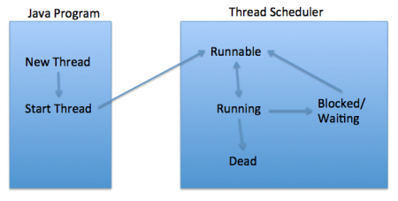

### Java_Thinking

### I. Unit Test/Logging/Perfomance
1. Unit test
- Unit Test là một phần chương trình được viết bởi developer, thực hiện một chức năng nhất định, và sẽ được test
- Unit test giúp kiểm tra logic vủa một chương trình là đúng hay sai.
- Một Unit test có thể là một đoạn code, một mothod, một class... 
- Mục đích viết Unit test là để phân chia chườn trình thành các phần nhỏ, và kiểm tra tính đúng đắn của từng phần 
<b></b>

### II.  Threading

#### 1. Thread
- <b style="color:red">A process</b> is a self contained execution environment and it can be seen as a program or application.
- <b style="color:red">Thread</b> can be called lightweight process. Thread requires less resources to create and exists in the process, thread shares the process resources.

- A thread goes through various stages in its life cycle. For example, a thread is born, started, runs, and then dies. The following diagram shows the complete life cycle of a thread.


<b>New </b> A new thread begins its life cycle in the new state. It remains in this state until the program starts the thread. It is also referred to as a born thread.

<b>Runnable</b> After a newly born thread is started, the thread becomes runnable. A thread in this state is considered to be executing its task.

<b> Waiting </b>− Sometimes, a thread transitions to the waiting state while the thread waits for another thread to perform a task. A thread transitions back to the runnable state only when another thread signals the waiting thread to continue executing.

<b>Dead</b> A thread enters the terminated state when it completes its task or terminates.

<b>Multithreading</b> refers to tow or more threads excuting concurrently in a program. A computer single core hve only one thread excutes at a time.

<b style="color:red">Java thread benefits</b>:  
    - threads are lightweigh compared to processes, it take less time and resources to create a thread.
    - thread shares their parents process and code.

#### How to create thread in Java
Threads can be created by using two mechanisms :
+ Extending the Thread class
+ Implementing the Runnable Interface

<b>Thread creation by extending the Thread class</b>
We create a class that extends the java.lang.Thread class. This class overrides the run() method available in the Thread class. A thread begins its life inside run() method. We create an object of our new class and call start() method to start the execution of a thread. Start() invokes the run() method on the Thread object.

```
// Java code for thread creation by extending 
// the Thread class 
class MultithreadingDemo extends Thread 
{ 
    public void run() 
    { 
        try
        { 
            // Displaying the thread that is running 
            System.out.println ("Thread " + 
                  Thread.currentThread().getId() + 
                  " is running"); 
  
        } 
        catch (Exception e) 
        { 
            // Throwing an exception 
            System.out.println ("Exception is caught"); 
        } 
    } 
} 
  
// Main Class 
public class Multithread 
{ 
    public static void main(String[] args) 
    { 
        int n = 8; // Number of threads 
        for (int i=0; i<8; i++) 
        { 
            MultithreadingDemo object = new MultithreadingDemo(); 
            object.start(); 
        } 
    } 
} 
```
Ouput

```
Thread 8 is running
Thread 9 is running
Thread 10 is running
Thread 11 is running
Thread 12 is running
Thread 13 is running
Thread 14 is running
Thread 15 is running
```

However, in Java 8 we can create Thread like below
```
Thread t = new Thread(() -> {System.out.println("My Runnable");});
t.start();
```

<b>Thread creation by implementing the Runnable Interface</b>

```
class MultithreadingDemo implements Runnable 
{ 
    public void run() 
    { 
        try
        { 
            // Displaying the thread that is running 
            System.out.println ("Thread " +     
                                Thread.currentThread().getId() + 
                                " is running"); 
  
        } 
        catch (Exception e) 
        { 
            // Throwing an exception 
            System.out.println ("Exception is caught"); 
        } 
    } 
} 
  
// Main Class 
class Multithread 
{ 
    public static void main(String[] args) 
    { 
        int n = 8; // Number of threads 
        for (int i=0; i<8; i++) 
        { 
            Thread object = new Thread(new MultithreadingDemo()); 
            object.start(); 
        } 
    } 
} 
```

Output :
```
Thread 8 is running
Thread 9 is running
Thread 10 is running
Thread 11 is running
Thread 12 is running
Thread 13 is running
Thread 14 is running
Thread 15 is running

```
<b>Thread Class vs Runnable Interface </b>
 - If we extend the Thread class, our class cannot extend any other class because Java doesn’t support multiple inheritance. But, if we implement the Runnable interface, our class can still extend other base classes.

<b style="color:red" >Java Sleep</b>
Thread.sleep() method can be used to pause the execution of current thread for specified time in milliseconds. The argument value for milliseconds can’t be negative, else it throws IllegalArgumentException.

```
public class ThreadSleep {

    public static void main(String[] args) throws InterruptedException {
        long start = System.currentTimeMillis();
        Thread.sleep(2000);
        System.out.println("Sleep time in ms = "+(System.currentTimeMillis()-start));
        
    }

}
```
<i><b>How Thread Sleep Works</b></i>
Thread.sleep() interacts with the thread scheduler to put the current thread in wait state for specified period of time. Once the wait time is over, thread state is changed to runnable state and wait for the CPU for further execution. So the actual time that current thread sleep depends on the thread scheduler that is part of operating system.

<b style="color:red">Java Thread join </b>
<b>public final void join()</b>: This java thread join method puts the current thread on wait until the thread on which it’s called is dead. If the thread is interrupted, it throws InterruptedException.
<b>public final synchronized void join(long millis)</b>: This java thread join method is used to wait for the thread on which it’s called to be dead or wait for specified milliseconds. Since thread execution depends on OS implementation, it doesn’t guarantee that the current thread will wait only for given time.

see example below
```
public class ThreadJoinExample {

    public static void main(String[] args) {
        Thread t1 = new Thread(new MyRunnable(), "t1");
        Thread t2 = new Thread(new MyRunnable(), "t2");
        Thread t3 = new Thread(new MyRunnable(), "t3");
        
        t1.start();
        
        //start second thread after waiting for 2 seconds or if it's dead
        try {
            t1.join(2000);
        } catch (InterruptedException e) {
            e.printStackTrace();
        }
        
        t2.start();
        
        //start third thread only when first thread is dead
        try {
            t1.join();
        } catch (InterruptedException e) {
            e.printStackTrace();
        }
        
        t3.start();
        
        //let all threads finish execution before finishing main thread
        try {
            t1.join();
            t2.join();
            t3.join();
        } catch (InterruptedException e) {
            // TODO Auto-generated catch block
            e.printStackTrace();
        }
        
        System.out.println("All threads are dead, exiting main thread");
    }

}

class MyRunnable implements Runnable{

    @Override
    public void run() {
        System.out.println("Thread started:::"+Thread.currentThread().getName());
        try {
            Thread.sleep(4000);
        } catch (InterruptedException e) {
            e.printStackTrace();
        }
        System.out.println("Thread ended:::"+Thread.currentThread().getName());
    }
    
}
```
Output
```
Thread started:::t1
Thread started:::t2
Thread ended:::t1
Thread started:::t3
Thread ended:::t2
Thread ended:::t3
All threads are dead, exiting main thread
```


<b style="color:red">Thread Life Cycle in Java</b>

From previous, we can create a java thread class by implementing Runnable interface or by extending Thread class, but to start a java thread, we first have to create the Thread object and call it’s start() method to execute run() method as a thread.


<b>New</b>
When we create a new Thread object using new operator, thread state is New Thread. At this point, thread is not alive and it’s a state internal to Java programming.

<b>Runnable</b>
When we call start() function on Thread object, it’s state is changed to Runnable. Whether to run this thread instantly or keep it in runnable thread pool before running, depends on the OS implementation of thread scheduler.

<b>Running</b>
When thread is executing, it’s state is changed to Running. Thread scheduler picks one of the thread from the runnable thread pool and change it’s state to Running. Then CPU starts executing this thread. A thread can change state to Runnable, Dead or Blocked from running state depends on time slicing, thread completion of run() method or waiting for some resources.

<b>Blocked/Waiting</b> 
A thread can be waiting for other thread to finish using thread join or it can be waiting for some resources to available. For example producer consumer problem or waiter notifier implementation or IO resources, then it’s state is changed to Waiting. Once the thread wait state is over, it’s state is changed to Runnable and it’s moved back to runnable thread pool.

<b>Dead</b>
Once the thread finished executing, it’s state is changed to Dead and it’s considered to be not alive.

<b style="color:red">Java Thread wait, notify and notifyAll Example
</b>

<b>wait</b>
Object wait methods has three variance, one which waits indefinitely for any other thread to call notify or notifyAll method on the object to wake up the current thread. Other two variances puts the current thread in wait for specific amount of time before they wake up.
<b >notify</b>
notify method wakes up only one thread waiting on the object and that thread starts execution. So if there are multiple threads waiting for an object, this method will wake up only one of them. The choice of the thread to wake depends on the OS implementation of thread management.

<b>notifyAll</b>
notifyAll method wakes up all the threads waiting on the object, although which one will process first depends on the OS implementation.

EXample
Message
A java bean class on which threads will work and call wait and notify methods.

see example below
```
public class ThreadA {
    public static void main(String[] args){
        ThreadB b = new ThreadB();
        b.start();
 
        synchronized(b){
            try{
                System.out.println("Waiting for b to complete...");
                b.wait();
            }catch(InterruptedException e){
                e.printStackTrace();
            }
 
            System.out.println("Total is: " + b.total);
        }
    }
}
 
class ThreadB extends Thread{
    int total;
    @Override
    public void run(){
        synchronized(this){
            for(int i=0; i<100 ; i++){
                total += i;
            }
            notify();
        }
    }
}
```
In the example above, an object, b, is synchronized. b completes the calculation before Main thread outputs its total value.

Output:
```
Waiting for b to complete...
Total is: 4950

```

<b style="color:red">Java Thread Safety</b>

- we know that multiple threads created from same Object share object variables and this can lead to data inconsistency when the threads are used to read and update the shared data.

<b>Thread Safety in Java</b>
Thread safety in java is the process to make our program safe to use in multithreaded environment, there are different ways through which we can make our program thread safe.
   + Synchronization is the easiest and most widely used tool for thread safety in java.
    + Use of locks from java.util.concurrent.locks package

<b>Java synchronized</b>
Synchronization is the tool using which we can achieve thread safety, JVM guarantees that synchronized code will be executed by only one thread at a time.
+ Java synchronization works on locking and unlocking of resource, before any thread enters into synchronized code, it has to acquire lock on the Object and when code execution ends, it unlocks the resource that can be locked by other threads. In the mean time other threads are in wait state to lock the synchronized resource.

<b  style="color:red">Concurency</b>
Concurrency means that an application is making progress on more than one task at the same time (concurrently). Well, if the computer only has one CPU the application may not make progress on more than one task at exactly the same time, but more than one task is being processed at a time inside the application. It does not completely finish one task before it begins the next.


<b style="color:red">Threadpool</b>

<b style="color:red">Executors.</b>